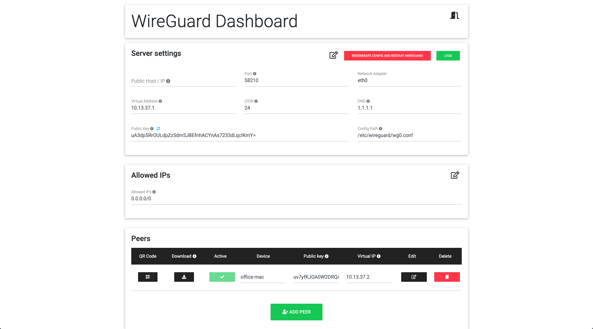

	

**THIS PROJECT IS UNMAINTAINED**

If you want to take over development please contact us. In the meantime we recommend having a look at:

- https://github.com/tailscale/tailscale
- https://github.com/subspacecommunity/subspace
- https://github.com/EmbarkStudios/wg-ui

# wg-dashboard

## Description

#### What is this?

wg-dashboard is a user friendly and easy to use interface to manage your WireGuard instance and peers.

#### Why did we make this?

We made this dashboard to simplify the setup of WireGuard. Instead of having to use the terminal to manage settings we wanted an easy to use and nice looking GUI.

## Requirements

* Ubuntu 18.04, Raspbian Buster or Debian 10
* root user

## Sponsoring

Thanks to [Team Centric Software](http://tcs.de) for sponsoring initial development

## Installation

#### Automatic Install

With our install script all the needed packages for WireGuard and wg-dashboard will be installed. Just follow the given steps.

1. Connect to your server and open a ssh tunnel from remote to local on port 3000
	* `ssh -L 3000:localhost:3000 <your_vps_user>@<your_vps_ip>`
2. Run the install script
	* `curl https://raw.githubusercontent.com/wg-dashboard/wg-dashboard/master/install_script.sh | sudo bash`
3. Go to [http://localhost:3000](http://localhost:3000) in your favorite browser
4. Enjoy

#### Manual Install

1. Connect to your VPS and open an ssh tunnel
	* `ssh -L 3000:localhost:3000 <your_vps_user>@<your_vps_ip>`
2. Download & install wireguard and wg-quick
3. Download & install node 10
4. Download and unzip the dashboard
5. Set `net.ipv4.ip_forward=1` in sysctl
6. Install CoreDNS (needed for DNS over TLS)
7. Put CoreDNS in autostart
8. Optional: Enable ufw and forward port 22 and the desired port of the wireguard instance
9. Put the dashboard in autostart
10. Start the dashboard service
11. Enjoy

## Features

* Dashboard with login system
* Dashboard user management
* Automatic creation of public and private keys for server and peers
* Peer administration
	* Generation of QR Codes
	* VPN configuration download
		* Enable/Disable peers
* WireGuard server management
	* Restart
	* Logs
* WireGuard config management
	* Host / IP
	* Port
	* Network adapter
	* Virtual address 
		* Allowed IP's for VPN clients
* CoreDNS config management
	* DNS Server
	* DNS over TLS
* Clean GUI

## Looking for a cheap VPS?

You are looking for a cheap VPS to run WireGuard on? Check these out:

-   [Hetzner](https://www.hetzner.com/cloud)

#### Get free \$50 credit when you sign up on either of these!

-   [DigitalOcean](https://m.do.co/c/8d5e8ac9b8f1) (affiliate)

## Disclaimer

We are not, in any way, affiliated with WireGuard or their creators.

## Donations

If you would like support this project, please consider donating:

-   Bitcoin: `17WesqNX7ozumrufLWhukDCvwaiywHxny3`
-   Ethereum: `0x5d7836D6d3A10b1b970fb45E8f571A0cA3cE4f57`
-   Bitcoin Cash: `qr3vcp6zngks2mc42vpyakq76wlpngerj5z0e3pq9l`
-   Stellar: `GAA2EKSDAAUNM4GVTIGM7FKJSXCGUKNZKUNURHIUCHJ56M4ITB36F55K`
-   USDPAX: `0x5d7836d6d3a10b1b970fb45e8f571a0ca3ce4f57`
